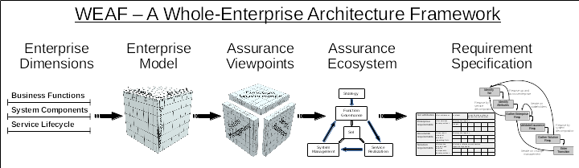

# WEAF - a Whole-Enterprise Architecture Framework

This repository contains documentation for WEAF, a whole-enterprise architecture framework.

## Overview

WEAF provides a standards-aligning unified enterprise model, an ecosystem covering business assurance concerns, and a requirement specification methodology which enforces traceability.

The framework is intended to advance the practice of enterprise architecture, business analysis, and software/system engineering.  
* WEAF is an answer to the grand challenge of ubiquitous traceability[1](#1).  
* WEAF enables the “preferred path”[2](#2) for enterprise model portability and interoperability.  
* WEAF defines an ecosystem that covers assurance concerns across the enterprise and throughout the lifecycle[3](#3).

<a name=”1”>1J. Cleland-Huang, O. C. Z. Gotel, J. Huffman Hayes, P. Mäder, and A. Zisman, “Software Traceability: Trends and Future Directions,” in Proceedings of the on Future of Software Engineering, New York, NY, USA, 2014, pp. 55–69</a>  
<a name=”2”>2*Industrial automation systems -- Concepts and rules for enterprise models*, ISO Standard 14258:1998</a>  
<a name=”3”>3D. Campara, “System Assurance and Related Standards”, OMG, 17-Jun-2015. \[Online\] Available: http://www.omg.org/news/meetings/tc/berlin-15/special-events/iiot-presentations/Campara.pdf \[Accessed: 2017-04-09\]</a>

A basic overview can be found in the [WEAF Overview](./overview/WEAF-overview.pdf).  A sketch of construction and usage is available in [WEAF Construction and Usage](./overview/WEAF-construction-and-usage.pdf).  A detailed summary that covers the essential components of WEAF is available in [WEAF Detailed Summary](./overview/WEAF-detailed-summary.pdf).

## Framework Structure

## Repository Structure
1. [Overview](./overview)
1. Framework
    * Enterprise dimensions
    * Enterprise model
    * Viewpoints
    * Assurance ecosystem
    * Requirement specification
1. Related Work
1. Future Work
1. Standards Compliance
    * ISO 15704 - Requirements for enterprise-reference architectures and methodologies 
    * ISO 19349 - Framework for enterprise modelling 
    * ISO 42010 - Architecture description
1. Standards Mapping
1. Viewpoint Derivation
1. Ontology
1. Applications

