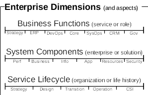
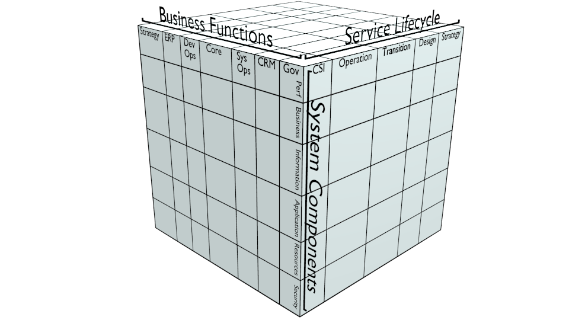
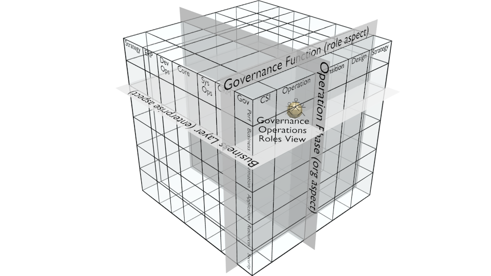
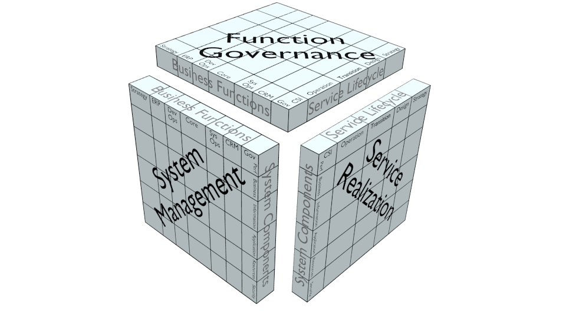
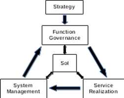

This post discusses the current state of enterprise architecture (EA) and its challenges.  A framework is proposed to address the challenges and advance the state of EA.

An enterprise is a complex network of people, processes, and resources that change continuously.  The capabilities required to understand, operate, and control an enterprise are a complex intersection of expertise domains.  EA is a discipline to cope with the complexity by holistically representing an enterprise while addressing stakeholder concerns.  The end goal is effective and efficient utilization of enterprise resources to realize enterprise goals.  EA methods, artifacts, and domain specific reference architectures are being standardized, but there is no standard for a unified model of the whole enterprise.ISO14258

Even with a unified enterprise model, assurance in the face of complexity is a key concern for realizing business outcomes.  Coverage and traceability of requirements have been identified as major challenges to providing assurance.  Assurance methods and artifacts are being standardized, but there is no standard for an assurance ecosystem that covers assurance across an enterprise and supports traceability footnote for OMG efforts.

For any business entity of interest (SoI), requirement specification is the basis for defining assurance of SoI outcomes.  A requirement specification is the bridge connecting business objectives to concrete instances.  Requirement specification methods and artifacts are being standardized, but enforcing coverage and traceability is problematic without a common model of the enterprise.

To answer to these challenges, a whole-enterprise architecture framework (WEAF) is proposed.  WEAF contains a unified enterprise model, an assurance ecosystem, and structured requirement specification to enforce coverage and traceability.

Context is identified using enterprise dimensions to provide coverage of people, processes, resources, and change: business functions, system components, and service lifecycle. Existing standards are aligned with the dimensions to support enterprise business practices in a modular fashion.  

The concept of an enterprise coordinate system is defined to realize a unified enterprise model.   This model is able to represent all business entities through their life history.
 
Representation viewpoints are derived via projections and restrictions of the dimensions.  Canonical projections along each dimension define assurance viewpoints for the model: function governance, system management, and service realization.  Business functions corresponding to the assurance viewpoints are used together with strategy to build an assurance ecosystem encompassing assurance concerns for any business entity.
   
The framework is completed with a requirement specification template and methodology.  These capture SoI attributes and requirements, support coverage of strategic and stakeholder concerns, and enable ubiquitous traceability.  From this common basis, automated exchange of requirements is possible.
   
Current standards cover modeling *for* an enterprise.  WEAF provides a unified model *of* the enterprise.
